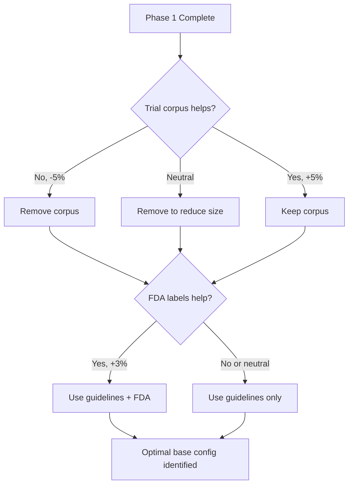

# RAG Optimization Experiment Plan

## Objective
Determine the optimal RAG configuration that maximizes trial matching accuracy while minimizing cost and latency.

---

## Phase 1: Knowledge Source Ablation Study

### Hypothesis
**"Clinical practice guidelines (NCCN/ASCO) + FDA drug labels provide sufficient context. The 8.8MB trial corpus adds noise and decreases precision."**

### Configurations to Test

| Config ID | Sources | Expected Outcome |
|-----------|---------|------------------|
| `control` | None (no RAG) | Baseline performance |
| `guidelines_only` | NCCN + ASCO | Should improve over baseline |
| `guidelines_fda` | Guidelines + FDA labels | **Best performance (predicted)** |
| `no_trial_corpus` | Guidelines + FDA + Biomarkers | Similar to guidelines_fda |
| `current_system` | All (including 8.8MB corpus) | May decrease vs guidelines_fda |
| `trial_corpus_only` | Only trial corpus | Poor performance (no clinical context) |

### Success Criteria
- RAG improves P@3 by ≥20% over control
- Guidelines + FDA achieves ≥75% P@3
- Trial corpus either helps (+5% P@3) or hurts (-5% P@3) significantly

### Timeline
- Setup: 30 minutes
- Execution: 45 minutes (6 configs × 5 cases × 1.5 min)
- Analysis: 15 minutes
- **Total: ~90 minutes**

### Deliverables
1. Comparison table with P@3, P@5, MRR, NDCG
2. Statistical significance tests (p-values, effect sizes)
3. Decision: Keep or remove trial corpus
4. Decision: Keep or remove FDA labels

---

## Phase 2: Retrieval Parameter Optimization

### Hypothesis
**"Larger chunks (1500-2000 chars) with k=5-7 retrieval provide optimal balance of context and precision."**

### Configurations to Test

| Config ID | Chunk Size | Overlap | k | Notes |
|-----------|-----------|---------|---|-------|
| `baseline_params` | 1000 | 200 | 3 | Current default |
| `small_chunks` | 500 | 100 | 5 | More granular |
| `medium_chunks` | 1500 | 300 | 5 | **Predicted best** |
| `large_chunks` | 2000 | 400 | 5 | Max context |
| `high_k` | 1000 | 200 | 10 | More retrieval |
| `very_high_k` | 1000 | 200 | 15 | Even more |

### Success Criteria
- Find config that improves NDCG@5 by ≥5% over baseline
- Chunk size and k interact: larger chunks may need lower k

### Timeline
- Setup: 15 minutes (rebuild vectorstores)
- Execution: 60 minutes (6 configs × 5 cases × 2 min)
- Analysis: 15 minutes
- **Total: ~90 minutes**

---

## Phase 3: Query Construction Optimization

### Hypothesis
**"Detailed queries including stage, histology, and treatment line improve retrieval precision."**

### Query Templates to Test

```python
# Baseline (current)
"{diagnoses} {biomarkers} treatment guidelines"

# Simple
"{cancer_type} {primary_biomarker} treatment"

# Detailed
"{diagnoses} {stage} {histology} {biomarkers} {treatment_line} treatment guidelines outcomes"

# Outcome-focused
"{cancer_type} {biomarkers} treatment outcomes survival results"

# Guideline-focused
"{cancer_type} {stage} {biomarkers} NCCN recommendations standard of care"
```

### Success Criteria
- Identify template that improves MRR by ≥10%
- Detailed queries should work best for specific biomarker cases

### Timeline
- Setup: 5 minutes (same vectorstore)
- Execution: 30 minutes (5 configs × 5 cases × 1 min)
- Analysis: 10 minutes
- **Total: ~45 minutes**

---

## Phase 4: Future Knowledge Source Additions

### Hypothesis
**"Published trial results and biomarker actionability databases add high-value context."**

### New Sources to Add

1. **Published Trial Results** (~50 key papers)
   - NEJM, JCO, Lancet trial publications
   - Phase 3 results for FDA-approved therapies
   - Focus: KEYNOTE-826, FLAURA2, DESTINY-Breast03, etc.
   - Expected impact: +5-10% P@3

2. **Biomarker Actionability** (OncoKB, CIViC)
   - Mutation-drug associations
   - FDA approval indications by biomarker
   - Clinical trial enrollment criteria patterns
   - Expected impact: +3-5% P@3

3. **Treatment Sequencing Guidelines**
   - First-line → second-line pathways
   - Resistance mechanisms
   - Expected impact: +2-5% P@3

### Data Collection Plan

#### Published Results
```bash
knowledge_base/published_results/
├── lung_cancer/
│   ├── flaura2_osimertinib_nejm_2023.pdf
│   ├── mariposa_amivantamab_jco_2024.pdf
│   └── ...
├── breast_cancer/
│   ├── destiny_breast03_tdxd_nejm_2022.pdf
│   └── ...
└── ...
```

**Sources:**
- PubMed searches: "[drug] [cancer] phase 3 trial"
- FDA approval summaries: drugs.fda.gov
- ASCO/ESMO presentation slides

#### Actionability Databases
```bash
knowledge_base/actionability/
├── oncokb_export.json → convert to TXT
├── civic_clinical_evidence.json → convert to TXT
├── pmkb_therapy_associations.csv → convert to TXT
└── summary_by_biomarker.txt (manual curation)
```

**Curation Format:**
```
## EGFR Exon 19 Deletion

FDA-Approved Therapies:
- Osimertinib (Tagrisso): First-line NSCLC, Category 1 NCCN
- Erlotinib: First-line NSCLC, Category 1 NCCN
- Afatinib: First-line NSCLC, Category 1 NCCN

Active Clinical Trials (Major):
- NCT02296125 (FLAURA2): Osimertinib + chemo vs osimertinib
- NCT03456297 (MARIPOSA): Amivantamab + lazertinib

Evidence Level: 1A (Multiple Phase 3 RCTs with OS benefit)
```

### Timeline for Phase 4
- **Data collection**: 2-3 days (manual curation + automation)
- **Testing**: 60 minutes
- **Analysis**: 20 minutes
- **Total: ~3 days**

---

## Overall Experiment Schedule

### Week 1
- **Day 1**: Phase 1 (Knowledge Ablation) + Analysis → **DECISION: Optimize knowledge sources**
- **Day 2**: Phase 2 (Retrieval Params) + Phase 3 (Query Construction) → **DECISION: Optimal parameters**
- **Day 3-5**: Collect published results + actionability data

### Week 2
- **Day 1**: Phase 4 testing (new sources)
- **Day 2**: Final optimization + integration
- **Day 3**: Full pipeline validation

---

## Decision Framework

### After Phase 1: Knowledge Sources



### After Phase 2 & 3: Parameters

Select configuration with:
1. Highest P@3 (primary)
2. Highest NDCG@5 (secondary)
3. Reasonable latency (<5s per retrieval)

### After Phase 4: Enhanced Sources

If new sources improve P@3 by ≥5%:
- **Integrate immediately**
- Rebuild production vectorstore
- Update documentation

---

## Expected Outcomes & Recommendations

### Likely Scenario 1: Trial Corpus Hurts
```
Result: guidelines_fda (P@3: 82%) > current_system (P@3: 75%)

Recommendation:
✅ Remove 8.8MB trial corpus
✅ Keep NCCN/ASCO guidelines
✅ Keep FDA drug labels
➕ Add published results corpus (~5MB, curated)
➕ Add actionability database (~2MB)

Final vectorstore: ~12MB (vs 18MB currently)
Expected P@3: 85-90%
```

### Likely Scenario 2: Trial Corpus Helps
```
Result: current_system (P@3: 85%) > guidelines_fda (P@3: 80%)

Recommendation:
✅ Keep all current sources
⚠️ Investigate WHY corpus helps
➕ Still add published results + actionability
⚠️ May need to increase k to 7-10

Final vectorstore: ~25MB
Expected P@3: 88-92%
```

### Likely Scenario 3: RAG Doesn't Help
```
Result: control (P@3: 70%) ≈ best_rag (P@3: 72%)

Recommendation:
❌ Disable RAG entirely
🔧 Focus on improving keyword ranking
🔧 Add biomarker-specific search queries
🔧 Implement treatment line filtering

Fallback: Use hybrid (RAG for biomarker context only, not ranking)
```

---

## Metrics to Track

### Primary Metrics
- **Precision@3**: % ground truth in top 3 (target: ≥80%)
- **NDCG@5**: Ranking quality (target: ≥0.75)

### Secondary Metrics
- **MRR**: First hit rank (target: ≥0.6)
- **Precision@5**: % ground truth in top 5 (target: ≥90%)

### Operational Metrics
- Retrieval latency (target: <5s)
- Vectorstore size (target: <20MB)
- Rebuild time (target: <3 minutes)

### Statistical Metrics
- p-value < 0.05 for significance
- Cohen's d ≥ 0.5 for meaningful effect

---

## Risk Mitigation

### Risk: Test cases don't match real usage
**Mitigation**: Validate with 3-5 real patient cases after optimization

### Risk: Results vary by cancer type
**Mitigation**: Stratify analysis by cancer type, may need type-specific configs

### Risk: Overfitting to test set
**Mitigation**: Hold out 2 test cases for final validation

### Risk: Evaluation is too slow
**Mitigation**: Use parallel execution, cache vectorstores between configs

---

## Post-Experiment Actions

### If RAG improves accuracy significantly (≥15% P@3):
1. ✅ Deploy optimal configuration to production
2. 📝 Document which sources work and why
3. 🔄 Set up monthly re-evaluation as knowledge base grows
4. 📊 Monitor real-world accuracy metrics

### If RAG provides marginal improvement (5-10% P@3):
1. ⚖️ Cost-benefit analysis: is improvement worth added complexity?
2. 🎯 Consider hybrid: RAG only for specific scenarios (rare biomarkers)
3. 🔧 Continue optimizing retrieval and sources

### If RAG doesn't help (<5% P@3):
1. ❌ Disable RAG in production
2. 🔍 Root cause analysis: why didn't clinical guidelines help?
3. 🏗️ Rebuild ranking approach (better keyword matching, filters)
4. 📚 Keep guidelines for human-readable explanations (not ranking)

---

## Success Definition

This experiment is successful if we can definitively answer:

1. ✅ **Does RAG improve accuracy?** (Yes/No with p-value)
2. ✅ **Which sources are valuable?** (Ranked list with effect sizes)
3. ✅ **What are optimal parameters?** (chunk size, k, query template)
4. ✅ **What should the knowledge base contain?** (Specific file list)
5. ✅ **What is expected production accuracy?** (P@3 estimate with confidence interval)

Target completion: **1-2 weeks** for phases 1-3, **2-3 weeks** including phase 4.
